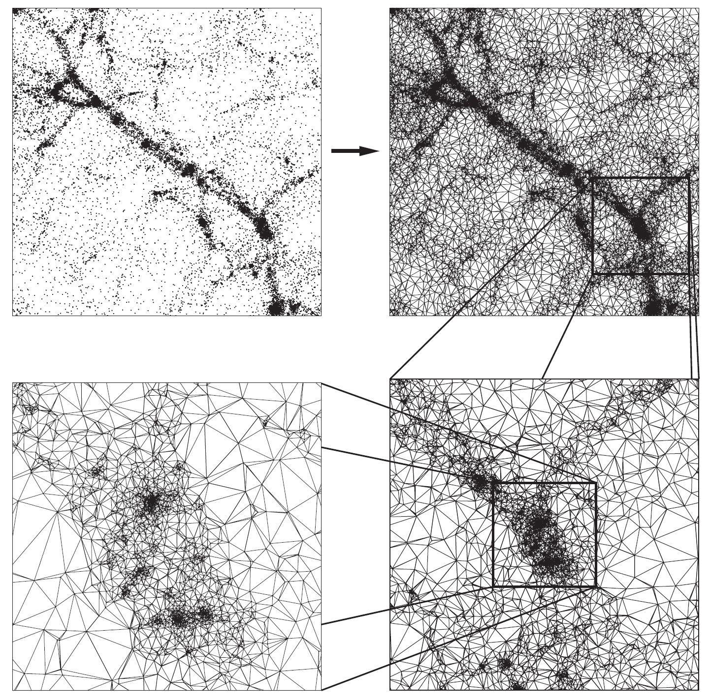

Rehost -> DTFE 1.2B
==================

This is a more stable but unofficial version of DTFE 1.2 (see the change log). Most notably there have been a few bug fixes in the file IO. The owner of this repository is not affiliated with the original authors of DTFE. The following text was taken directly from the [DTFE](http://www.astro.rug.nl/~voronoi/DTFE/dtfe.html) website.

The DTFE method
==================

The Delaunay Tessellation Field Interpolation (DTFE) method represents the natural way of going from discrete samples/measurements to values on a periodic grid using the maximum of information contained in the points set (that is the measurements points or particle distribution).

The DTFE method is especially suitable for astronomical data due to the following reasons:

 - Preserves the multi-scale character of the point distribution. This is the case in numerical simulations of large scale structure (LSS) where the density varies over more than 6 orders of magnitude.
 - Preserves the local geometry of the point distribution. This is important in recovering sharp features like the different components of the LSS (i.e. clusters, filaments, walls and voids).
 - DTFE does not depend on user defined parameters or choices.
 - The interpolated fields are volume weighted (versus mass weighted quantities in most other interpolation schemes). This can have a significant effect especially when comparing with analytical predictions which are volume weighted.

For detailed information about the DTFE method see the [Papers](http://www.astro.rug.nl/~voronoi/DTFE/papers.html) section.

The DTFE public software
==================

DTFE is free software, distributed under the [GNU General Public License](http://www.gnu.org/copyleft/gpl.html). This implies that you may freely distribute and copy the software. You may also modify it as you wish, and distribute these modified versions as long as you indicate prominently any changes you made in the original code, and as long as you leave the copyright notices, and the no-warranty notice intact. Please read the General Public License for more details. Note that the authors retain their copyright on the code.

The DTFE public code is a C++ implementation of the DTFE grid interpolation method. The code was written by Marius Cautun at the Kapteyn Astronomical Institute, Netherlands, with the purpose of analyzing cosmological numerical simulations and galaxy redshift survey. Even though the code was designed with astrophysics in mind, it can be used for problems in a wide range of fields where one needs to interpolate from a discrete set of points to a grid.

The code was designed using a modular philosophy and with a wide set of features that can easily be selected using the different program options. The DTFE code is also written using OpenMP directives which allow it to run in parallel on shared-memory architectures.

The code comes with a complete documentation and with a multitude of examples that detail the program features. Moreover, a help desk is available for information and assistance for troubleshooting problems.

Current features in the DTFE code
==================

 - Works in both 2 and 3 spatial dimensions.
 - Interpolates the fields to three different grids:
    - Regular rectangular grid.
    - Redshift cone grid.
    - User given sampling points - these can describe any complex geometry.
 - Uses the point distribution itself to compute the density and interpolates the result to grid.
 - Each sample point has a weight associated to it to represent multiple resolution N-body simulations and observational biases for galaxy redshift surveys.
 - Interpolates the velocity, velocity gradient, velocity divergence, velocity shear and velocity vorticity.
 - Interpolates any additional number of fields and their gradients to grid.
 - Periodic boundary conditions.
 - Zoom in option for regions of interest.
 - Splitting the full data in smaller computational chunks when dealing with limited CPU resources.
 - The computation can be distributed in parallel on shared-memory architectures.
 - Also comes with the TSC and the SPH interpolation methods.
 - Can return the Delaunay tessellation of the given point set.
 - Easy change of input/output data format.
 - Easy to use as an external library.
 - Extensive documentation of each feature.

At the moment the code comes with a Gadget snapshot reader for the input data, as well as with examples on how to load data from binary and text files. There are plans to offer input data readers for other types of input files (especially those specific to N-body codes), so if you are using the DTFE program with another reader, you can contact the help desk if you would like to include that reader in the official distribution. At the same time we are also looking for output data writing functions (especially to formats used in analysis and visualization programs) - at the moment the programs writes the output data to a binary or text file.
